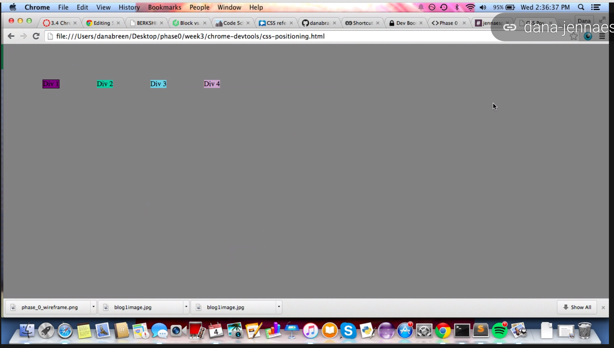

##Positioning and Chrome's DevTools Reflection

###How can you use Chrome's DevTools inspector to help you format or position elements?
The Chrome DevTools inspector can help you to format or position elements because it allows you to select an element and make temporary changes that you can view immediately. When using the DevTools inspector you can view which property-value pairs create changes that you may want to apply permanently rather than making changes in your CSS file and refreshing the webpage to see how the elements were affected.

###How can you resize elements on the DOM using CSS?
To resize elements on the DOM using CSS you can edit existing CSS property-value pairs, add CSS property-value pairs, or create a new CSS rule.  Some properties you can use to resize elements by setting a value are height, width, padding, margin, and border.


###What are the differences between absolute, fixed, static, and relative positioning? Which did you find easiest to use? Which was most difficult?

####Absolute Positioning
```
*positions the element in relation to its closest positioned ancestor or containing element
*it will move along the page as a user scrolls if it has no positioned ancestors
*use top or bottom and left or right to specify where the element should appear
```

####Fixed Positioning
```
*positions an element in relation to the browser window rather than the containing element
*stays in the same place when the page is scrolled and doesn't affect the position of surrounding elements
*use the top or bottom and right or left properties to position the element
```

####Static Positioning
```
*this is the default position for elements
*when the keyword 'static' is used it allows the element to use the normal behavior
*static positioned elements are not affected by the properties top, right, bottom, left, and z-index
```

####Relative Positioning
```
*moves an element's position from its normal position or flow
*doesn't adjust the position of surrounding elements
*to shift a relatively-positioned element you set the top or bottom and right or left properties
```

Before starting this challenge I was unsure about how to use positioning and the differences between them, so it's hard to say what was the easiest or hardest.  I'm still trying to figure the differences when actually using it in CSS and I know that by using DevTools to experiment it will help me to gain a better understanding.


###What are the differences between margin, border, and padding?
```
padding: the area that surrouds the space between the content and border
border: the edge of the element surrounding the padding and content
margin: the space around an element that clears an area outside of the border and can create gaps between elements
```

###What was your impression of this challenge overall? (love, hate, and why?)
I really enjoyed this challenge and thought it was fun.  I liked that you could experiement with different property-value pairs and target various elements in the DOM.  I feel I was able to gain a better understanding of positioning and the box model by using the Chrome DevTools inspector.





