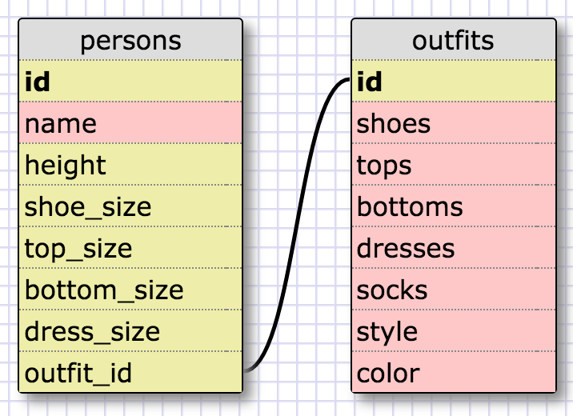

#Intro to Database Schemas and SQL Reflection


##SQL Queries

1) Select all data for all states:

`SELECT * FROM states;`

2) Select all data for the regions:

`SELECT * FROM regions;`

3) Select the state_name and population for all states:

`SELECT state_name, population FROM states;`

4) Select the state_name and population for all states ordered by population. The most populous state should be at the top:

`SELECT state_name, population FROM states ORDER BY population DESC;`

5) Select the 'state_name's for the states in region 7:

`SELECT state_name FROM states WHERE region = 7;`

6) Select the 'state_names' and 'population_density' with a population density over 50 ordered from least to most dense:

`SELECT state_name, population_density FROM states WHERE population_density > 50 ORDER BY population_density ASC;`

7) Select all state_names for states with a population between 1 million and 1.5 million people:

`SELECT state_name FROM states WHERE population BETWEEN 1000000 AND 1500000;`

8) Select all state_names and region_id ordered by region in ascending order:

`SELECT state_name, region_id FROM states ORDER BY region_id ASC;`

9) Select the 'region_name' for the regions with "Central" in the name:

`SELECT region_name FROM regions WHERE region_name LIKE '%Central';`

10) Select all of the region names and the state names in ascending order by regional id:

`SELECT regions.region_name, states.state_name FROM regions INNER JOIN states ON regions.id=states.region_id ORDER BY states.region_id ASC;`


##`persons ` and `outfits` Schema



##Reflection
###What are databases for?
Databases are used for storing information/data in organized collections. This makes it is easy to search and access the data that needs to be accessed, managed, and updated.


###What is a one-to-many relationship?
A one-to-many relationship means that a single record (or row) of one table in a relational database can relate directly to multiple rows of another table.  When looking at a database schema you could complete the phrases "____ has many ____" and "____ belongs to _____" to help give you clues about the relationship between the data.  For example, when shopping at an online store, the website stores information about its customers and their orders.  One customer can have zero to many orders but an order can only have one customer.


###What is a primary key? What is a foreign key? How can you determine which is which?
A primary key is a table column containing unique values like customer numbers, order numbers, etc. If the primary key is used in a column of another table and its values are used more than once in the other table, it is a foreign key in this other table.

A foreign key is a field (or collection of fields) in one table that uniquely identifies a row of another table, which is used to establish and enforce a link between two tables.

You can determine which is a primary key or a foreign key because a primary key can't be repeated, but a foreign key could possibly be repeated.


###How can you select information out of a SQL database? What are some general guidelines for that?
When you select(read) information out of a SQL database you need to follow the syntax for issuing SQL queries. SQL is not case sensitive but the SQL keywords are typed in uppercase letters and column names, database names, and conditions are typed in lowercase letters with each query ending in a semicolon.


To select information from an SQL database:
```
`SELECT * From table_name`: the asterisk * wildcard will select all the columns `FROM` a table
`SELECT column_name FROM table_name`: the name of the column or chosen columns will be selected `FROM` a table.

`GROUP BY [column_name]`: groups together the rows of data that share the [column_name]

`ORDER BY [column_name]`: sorts data by ascending order with the `ASC` keyword, or descending order with the `DESC` keyword.

`LIMIT`: the number is the maximum number of rows displayed.

`WHERE [column_name]`: filters which data gets shown using:

`BETWEEN [some_value] AND [another_value]`L displays data that falls within the range

`LIKE`: displays data that matches a specific pattern with the underscore `_` is a wildcard for only 1 character and the percent `%` is a wildcard for 1 or more characters.

`AND`: used to chain 2 or more filters/modifiers.
```
