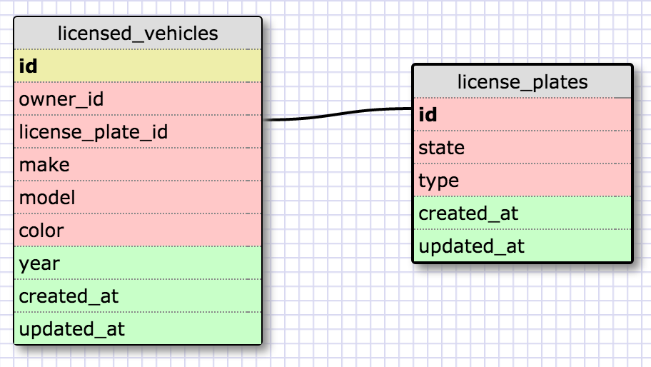

#More Database Schemas

###One-to-One Schema

This is a one-to-one relationship because each vehicle can only have one license plate number(id). Each row in the licensed vehicles table can only relate to an individual row in the license plates table, in which there shouldn't be any license plates without licensed cars or vice-versa.

###Many-to-Many Schema