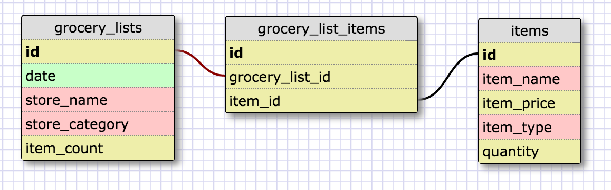

#More Database Schemas

##One-to-One Schema

This is a one-to-one relationship because each vehicle can only have one license plate number(id). Each row in the licensed vehicles table can only relate to an individual row in the license plates table, in which there shouldn't be any license plates without licensed cars or vice-versa.

##Many-to-Many Schema

##Reflect

###What is a one-to-one database?
A one-to-one database is when the relationship between two tables is unique at the row level. In other words, any row in the first table can only be related to one row in the second table creating a pair.

###When would you use a one-to-one database? (Think generally, not in terms of the example you created).
You would use a one-to-one database when you want to establish a unique pairing where you have a relationship in which a group of fields can all optionally be empty.

###What is a many-to-many database?
A many-to-many database is when the relationship between two tables is connected using a joining table that contains at least the ids of the two tables it's linking and other information can be added to a join table that is specific to that instance.

###When would you use a many-to-many database? (Think generally, not in terms of the example you created).
You would use a many-to-many database when you explicitly want multiple rows of one table to relate or correspond with multiple rows in another. Using many-to-many databases is more common than one-to-one databases.

###What is confusing about database schemas? What makes sense?
I understand the logic behind one-to-one, one-to-many, and many-to-many database schemas and the examples used for each type. However, it can bit tricky to come up with situations in which it's best to use each one since these are relatively new concepts that I haven't be able to apply to things like websites, web apps, etc. Also, it can be difficult to structure all the necessary fields for each table in a database since essentially it's a matter of design.
